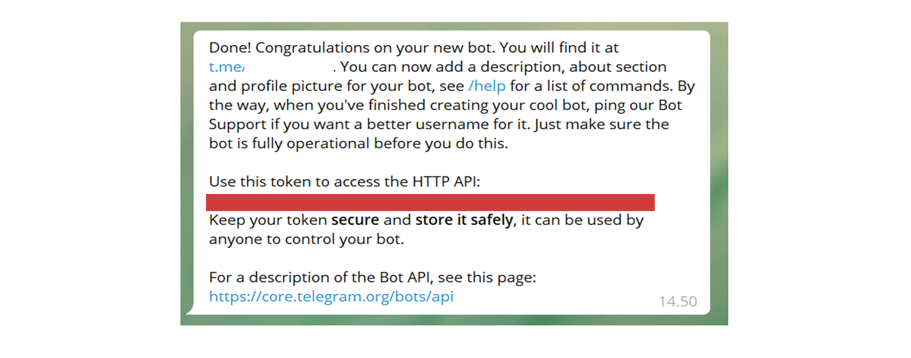

# Telegram bridge

## Create your Telegram bot

Go to Telegram and search and join the channel **@botfather**. You can see all the commands byt typing _/start_.

Next type _/newbot_ and press enter. Give your bot a name, it must end in `bot`. Your bot is now ready, and you should get this feedback:



Copy your token to `TELEGRAM_BOT_TOKEN` .env. Put your token value inside quotation marks. Set `TG_BRIDGE_ENABLED=true`.

## Add your bot to your channel

Invite your bot to your Telegram channel. First go to your channel. From the right top corner choose three dots and from the drop-down menu choose _Add members_. Give your bot a name and press add.

Give your bot admin role (choose channel member and give your bot admin rights). You need to have an admin role to do this change. Under _What can this admin do?_ mark all the showing rights off.

## Make the bridge

On your telegram group that you want bridge to discord course `courseName` send command `/bridge <courseName>`.
For example, to bridge telegram group `tkt-tito` to discord course `tito` use command `/bridge tito` in telegram group.

Bot answers
```
Bridge created: Discord course <courseName> <--> Telegram course <telegramGroup>
```
if bridge is created successfully.

If `courseName` is invalid bot answers with message
```
Bridge not created: Invalid discord channel <courseName>
```
