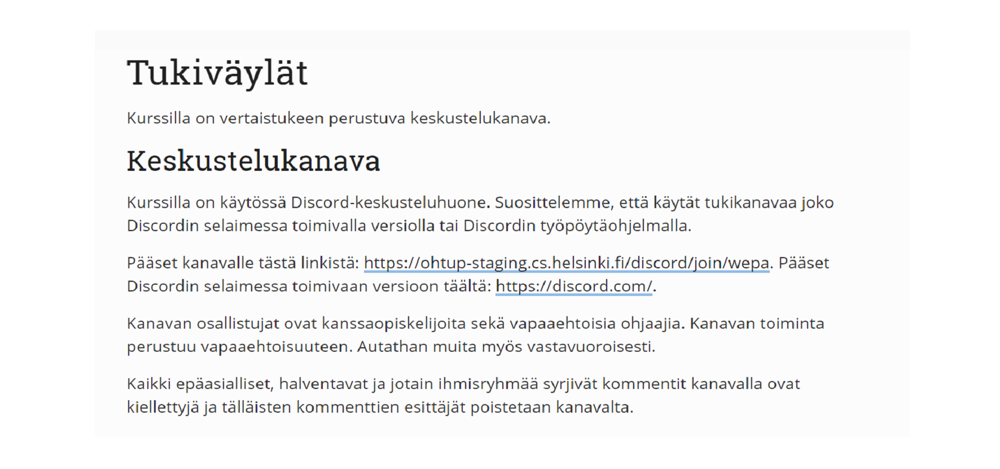
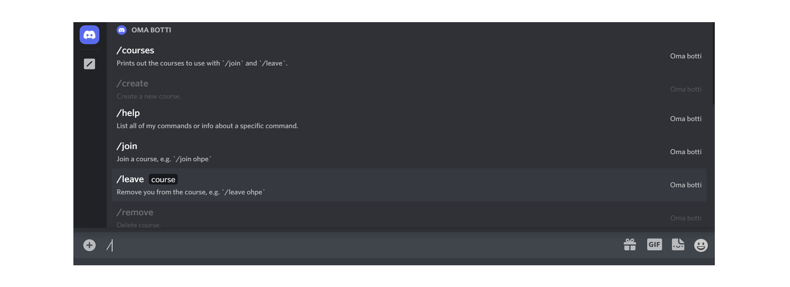

# User manual for faculty

### About Discord

The Discord group (course channel) is for peer support for students. We recommend that you use the group with either browser-based version of Discord or Discord application (desktop app or mobile app).

### Create your Discord account
Create yourself a Discord account. You can do this on [Discord Website](https://discord.com/). If you already have the account, you can login [here](https://discord.com/login).

If you’re on a desktop or mobile device, you can directly open the Discord app on your device (You can learn more information on downloading the app [here](https://support.discord.com/hc/en-us/articles/360033931551)).

Once you’re at the login page, type in either _your email address_ or _phone number_ that has been officially verified to your Discord account. 

Note: You will need to verify your phone number to your Discord account before using phone number login! [Click here](https://support.discord.com/hc/en-us/articles/360033931551) to learn how to verify your phone number to your Discord account.

### Joining to the Discord

You can join to the Helsinki University Discord server in two different ways. Join directly to the server using this [link]( https://discord.gg/V5R9dZFCkD). Join directly using the course´s own link (MOOC, Moodle, etc.).



### How to use Discord

Discord is a very versalite communication platform and if you want to learn more about how to use it check [Beginner's Guide to Discord](https://support.discord.com/hc/en-us/articles/360045138571-Beginner-s-Guide-to-Discord#h_d33e3809-909b-4720-899d-db26c17bafa9).

We have created an assistant Bot that helps you. Here are instructions on how you can use it.

Commands can be used by typing to the bottom area `/` and after that the command you want to use. You can see all the available commands on the list that opens after typing `/` (shows on white text) or using the command `/help`.



### Authentication

To be able to use all the faculty commands, you need to authenticate yourself. Use command `/auth` and you receive an authentication link. Click the link and go through the verfication steps. Now you have the faculty role and you can use all the commands.

### Creating a new course

You can create new course with command `/create`. Give the command and after that give the _course code_, course´s _full name_ and course´s _nickname_. Nickname is optional and if not given then the coursecode will be also course´s nickname. **Note** that nickname is the value that is used as course´s name that users see on the Discord´s left column. So, we prefer that you give course a short nickname because it is more readable on Discord for the users. **Note** also that nickname is unique value.

#### Multilingual course name

If your course has multilingual course name, enter all the information in the _full name_ field.

#### Open university course

If your course is an open university course, use the abbreviation **MOOC** in the _full name_ field next to your course name.


After the course is created there is the invitation link for the course on the course´s guide channel. Share this on the needed platforms, so the students can join this channel. Another option for joining is using the `/join` command.

### Create Telegram bridge

Today, many courses use Telegram discussion channels. At the moment there are students that might use only one of these platforms (Discord or Telegram). Therefore, we want to connect Discord and Telegram chat channels so everyone can see all the conversations. The following steps are made in Telegram.

#### Add our Telegram bot to your Telegram channel

Invite the **@cs-discord-bot** bot to your Telegram channel. First go to your channel. From the right top corner choose three dots and from the drop-down menu choose _Add members_.

Give the bot admin role (choose channel member and give the bot admin rights). You need to have an admin role to do this change. Under _What can this admin do?_ mark all the showing rights off.

#### Make the bridge

Create the connection between Discord and Telegram channels. Use command `/bridge <your Discord course name>` on your Telegram group. For example, to bridge the Telegram group `tkt-tito` to discord course `tito` use the command `/bridge tito` in the Telegram group.

Bot answers
```
Bridge created: Discord course <courseName> <--> Telegram course <telegramGroup>
```
if the bridge is created successfully.

If `course name` is invalid bot answers with message
```
Bridge not created: Invalid discord channel <courseName>
```
Note that only one Telegram group can be connected to only one Discord course.

### How to create more text channels

The `/create` command automatically creates three sub-channels for the course. The sub-channels are: announcements (text channel), general (text channel) and one voice channel. To create more text channels for a course go inside the wanted course. Inside this course use `/newchannel` command followed by the desired text channel name to create new text channel.


Note that the channel name you give is the end part of the name. For example, in the picture new channel will be created with name _wepa_feedback_.

To remove added text channel use `/removechannel` command followed by the name of the text channel to be removed e.g., `/removechannel feedback` removes _wepa_feedback_. This command must also be used inside the course you want the channel to be removed. Note that announcements or general channels can not be removed.

## How to make course secret
Once the course is created, it can be made hidden. This means joining the course channel is only possible via link. To make a secret course use the `/hide` command followed by the course name. e.g.,, `/hide wepa`. The secret courses can be identified by the lock emoji. 

To make the course public again use the `/unhide` command followed by the course name. e.g., `/unhide wepa`. Public courses can be found with `/courses` command and with `/join` command, unlike secret courses.

## How to add instructor to a course
Students can use the `/instructors` command on a course and see all the instructors on that course. _Faculty_ members and the ones who already have the _course instructor_ role can give other users this course instructor role. The command is `/addinstructor` the value to give is the username you want to give the instructor role. Use this command inside the course you want the role to be.

## How to edit course name information

The `/edit` command allows you to edit the information for the course you are in. You can change the _course code_, _full name_ and _nickname_. If you change the value users see on the Discord´s left column, this value is either the course code or nickname depending on which values the course is based on, you have 15 minutes cooldown until you can use the command again.


### List of commands

Command | Explanation
--------|-----------
/auth | Returns the URL where the faculty role can be obtained.
/create | Create a new course. 
/hide | Make given course private, e.g., /hide weba.
/unhide | Make given course public, e.g., /unhide weba.
/newchannel | Create new text channel inside a course, e.g., /newchannel feedback.
/removechannel | Remove given text channel inside a course, e.g., /removechannel feedback.
/courses | Returns a list of all courses.
/edit | Edit course information, options; coursecode, full name, nickname
/help | Returns a list of commands with info or info about a specific command.
/instructors | Used in course channel returns a list of course instructors. Can be used anywhere when a parameter is given.
/addinstructor | Give instructor role to another user, e.g., /addinstructor @username.
/join | Joins you into the course given, e.g., /join ohpe.
/leave | Remove you from the course given, e.g., /leave ohpe.

### Material

[Source code for the Bot](https://github.com/CS-DISCORD-BOT/cs-discord-bot)