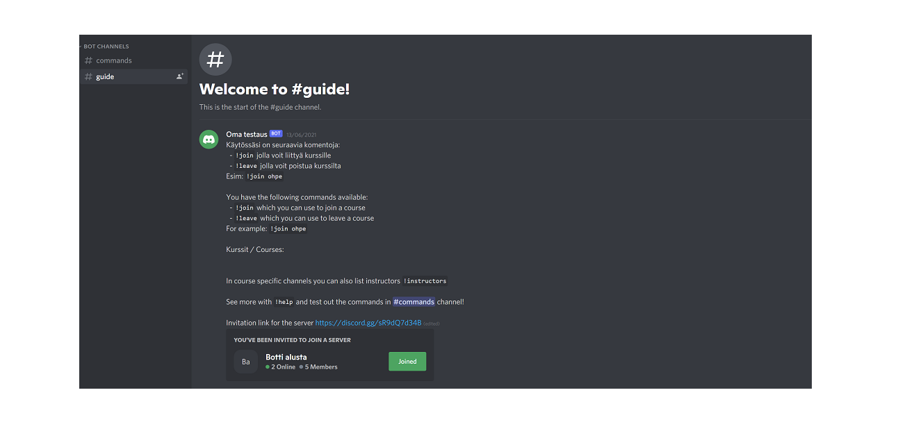
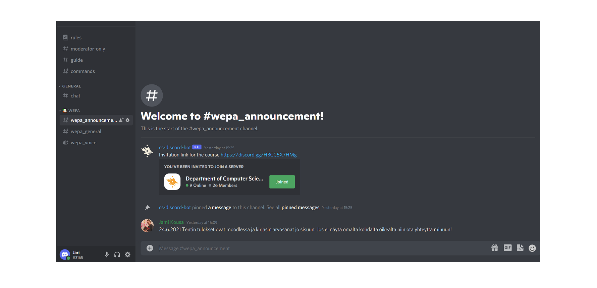

# User manual

### About Discord

The Discord group (course channel) is for peer support for students. We recommend that you use the group with either browser-based version of Discord or Discord application (desktop app or mobile app).

The participants of the group are fellow students as well as volunteer instructors. The group's activities are voluntary. Please also help others reciprocally. However, do not share task answers in this group to avoid accidentally depriving other students of learning opportunities. The little tips are instructive and still allow for the joy of learning yourself. Thank you.

### Create your Discord account
Create yourself a Discord account. You can do this on [Discord Website](https://discord.com/). If you already have the account, you can login [here](https://discord.com/login).

If you’re on a desktop or mobile device, you can directly open the Discord app on your device (You can learn more information on downloading the app [here](https://support.discord.com/hc/en-us/articles/360033931551)).

Once you’re at the login page, type in either _your email address_ or _phone number_ that has been officially verified to your Discord account. 

Note: You will need to verify your phone number to your Discord account before using phone number login! [Click here](https://support.discord.com/hc/en-us/articles/360033931551) to learn how to verify your phone number to your Discord account.

### Joining to the Discord course channel

Go to your _Course page_ (MOOC, Moodle, etc.). From there you can a find link to the Discord channel of the course.

Click the link and you will arrive at the course channel and here you can also see instructions of some of the commands you can use.

### How to use Discord

Discord is a very versalite communication platform and if you want to learn more about how to use it check [Beginner's Guide to Discord](https://support.discord.com/hc/en-us/articles/360045138571-Beginner-s-Guide-to-Discord#h_d33e3809-909b-4720-899d-db26c17bafa9).

We have created an assistant Bot that helps you. Here are instructions on how you can use it.

Commands can be used by typing to the bottom area `/` and after that the command you want to use. You can see all the available commands on the list that opens after typing `/` (shows on white text) or using the command `/help`.

You can see all the available courses with command `/courses`.

By typing the command `/join`, you can see all the courses available on the list that opens. Pick up the course you want to join and press enter.

If you want to leave a course, use command `/leave`. You see from the list all the courses you have joined earlier. Choose a course you want to leave from and press enter.

After you have joined a course, you can see different course channels on the left bar. At this stage there are four types of channels; announcement, general, questions and voice (these might change during the development).

Announcement - this is the course announcements and only teachers can make entries here.

General - main discussion area.

Questions - you can leave questions here for teachers of the course.

Voice - you can hang out over voice and video.

### List of commands

Command | Explanation
--------|-----------
/join | Joins you into the course given, e.g. /join ohpe
/leave | Remove you from the course given, e.g. /leave ohpe
/courses | Prints out all the courses
/instructors | Prints out the instructors of the course. This command is available in most channels

### Material

[Source code for the Bot](https://github.com/CS-DISCORD-BOT/cs-discord-bot)
